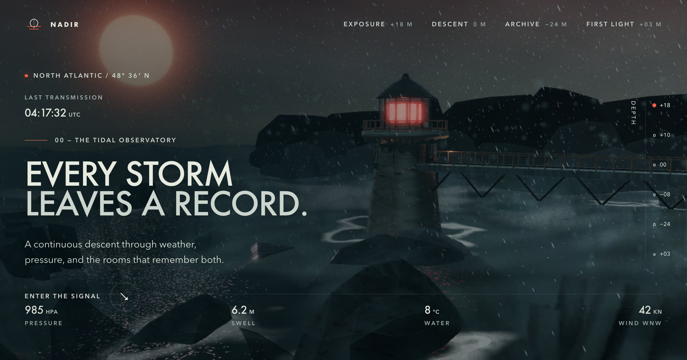

# Nadir — Archive Below the Tide

Nadir is an original, scroll-driven Three.js experience. The visitor follows a
storm signal down through a cliff observatory, below the waterline, into a
submerged archive, and back toward dawn.

One continuous world, a fixed WebGL camera, editorial HTML layers over it, and
locally generated imagery. Content is organised as narrative beats so it stays
readable and accessible, but the rendered experience never looks like stacked
landing-page sections.

**[nadir-livid.vercel.app](https://nadir-livid.vercel.app/)**



## Structure

```text
.
├── index.html            the whole document; one page, six narrative beats
├── src/
│   ├── styles/           four sheets: tokens, base, experience, responsive
│   └── js/               config + core / scene / motion / ui modules
├── assets/
│   ├── generated/        editorial plates and the Open Graph share card
│   └── foreground/       alpha-preserving near-plane cutouts
└── vendor/               Three.js, GSAP, ScrollTrigger, and their licenses
```

There is no framework, no build step and no runtime network dependency. Every
asset path is relative, so the site also runs unchanged from a subdirectory
rather than a domain root.

## Run locally

The page is ES modules, so it needs to be served over HTTP rather than opened
from the filesystem. Any static server will do:

```bash
python3 -m http.server 4427
```

Then open `http://127.0.0.1:4427/`.

Append `?debug=stats` to inspect accumulated scene and post draw calls, or
`?shot=0` through `?shot=5` to open at a named camera key.

## Deploy

The site is static and needs no build step, so any host that serves files will
work. Production is Vercel, deployed from this directory:

```bash
vercel --prod
```

No framework, no build command, and no environment to configure.

One thing is not relative. Open Graph requires absolute URLs, so the canonical
link and the share card carry the origin literally — five strings in the
`<head>`, plus the repository link in the footer. A fork served from anywhere
else needs those six changed and nothing more:

```bash
sed -i '' "s|nadir-livid.vercel.app|your-host/your-path|g; \
           s|github.com/rishabdesigns/nadir|github.com/you/your-repo|g" index.html
```

## License

Released under the [MIT License](LICENSE) — use it, modify it, ship it,
commercially or otherwise, with the copyright notice kept intact.

The runtimes vendored in `vendor/` are excluded and keep their own terms, which
are recorded in [`THIRD_PARTY_NOTICES.md`](THIRD_PARTY_NOTICES.md).
